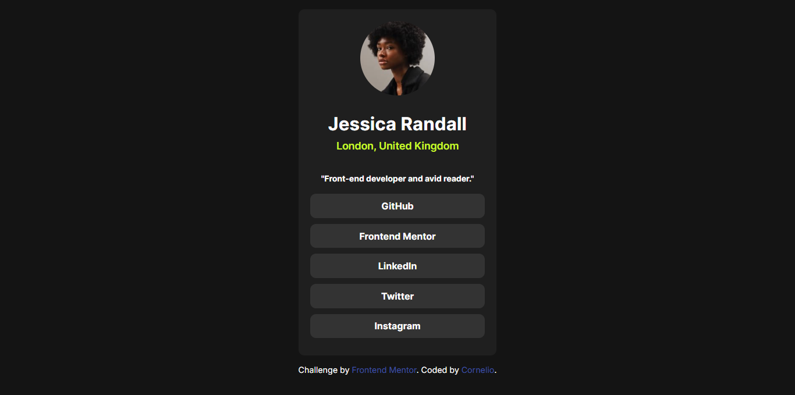

# Frontend Mentor - Social links profile solution

This is a solution to the [Social links profile challenge on Frontend Mentor](https://www.frontendmentor.io/challenges/social-links-profile-UG32l9m6dQ). Frontend Mentor challenges help you improve your coding skills by building realistic projects. 

## Table of contents

- [Frontend Mentor - Social links profile solution](#frontend-mentor---social-links-profile-solution)
  - [Table of contents](#table-of-contents)
  - [Overview](#overview)
    - [The challenge](#the-challenge)
    - [Screenshot](#screenshot)
    - [Links](#links)
  - [My process](#my-process)
    - [Built with](#built-with)
    - [Useful resources](#useful-resources)
  - [Do you have any feedback for me?](#do-you-have-any-feedback-for-me)
  - [Javascipt framework](#javascipt-framework)
    - [Vue.js + Vite](#vuejs--vite)
  - [Recommended IDE Setup](#recommended-ide-setup)
  - [Customize configuration](#customize-configuration)
  - [Project Setup](#project-setup)
    - [Compile and Hot-Reload for Development](#compile-and-hot-reload-for-development)
    - [Compile and Minify for Production](#compile-and-minify-for-production)
    - [Lint with ESLint](#lint-with-eslint)
  - [Javascipt framework](#javascipt-framework-1)
    - [Vue.js + Vite](#vuejs--vite-1)
  - [Recommended IDE Setup](#recommended-ide-setup-1)
  - [Customize configuration](#customize-configuration-1)
  - [Project Setup](#project-setup-1)
    - [Compile and Hot-Reload for Development](#compile-and-hot-reload-for-development-1)
    - [Compile and Minify for Production](#compile-and-minify-for-production-1)
    - [Lint with ESLint](#lint-with-eslint-1)
  - [Author](#author)

## Overview

### The challenge

Users should be able to:

- See hover and focus states for all interactive elements on the page

### Screenshot



### Links

- Solution URL: [social-links-profile](https://github.com/Timex30/social-links-profile)
- Live Site URL: [social-links-profile](https://timex30.github.io/social-links-profile/)

## My process

### Built with

- Semantic HTML5 markup
- CSS custom properties
- Flexbox
- CSS Grid
- Responsive design using Typography
- Mobile-first workflow
- [Vue.js](https://vuejs.org/) -  Js framework  

### Useful resources

- [web.dev](https://web.dev/) - This helped me for making a responsive layout and many more. I really liked this pattern and will use it going forward.
- [fedmentor.dev](https://fedmentor.dev/) - This is an amazing article which helped me finally understand how to ask for help(and actually get it!). I'd recommend it to anyone still learning this concept.

## Do you have any feedback for me?

I’d love to hear your thoughts and suggestions about this project! Whether it’s a bug you’ve found, a feature you’d like to see, or just general feedback, your input is highly valuable to me.

Here’s how you can provide feedback:

1. **Report an Issue**: If you encounter a bug or problem, please [open an issue](https://github.com/Timex30/social-links-profile/issues).
2. **Feature Requests**: Have an idea for improvement? Let us know by creating a feature request.
3. **Email Us**: Prefer direct communication? Feel free to send your feedback to [https://bsky.app/profile/cornelio30.bsky.social](https://bsky.app/profile/cornelio30.bsky.social).

I appreciate your support and contributions to making this project better!


## Javascipt framework

### Vue.js + Vite

This template should help get you started developing with [Vue 3](https://vuejs.org/guide/introduction.html) in [Vite](https://vite.dev/guide/).

## Recommended IDE Setup

[VSCode](https://code.visualstudio.com/) + [Volar](https://marketplace.visualstudio.com/items?itemName=Vue.volar) (and disable Vetur).

## Customize configuration

See [Vite Configuration Reference](https://vite.dev/config/).

## Project Setup

```sh
npm install
```

### Compile and Hot-Reload for Development

```sh
npm run dev
```

### Compile and Minify for Production

```sh
npm run build
```

### Lint with [ESLint](https://eslint.org/)

```sh
npm run lint
```

## Javascipt framework

### Vue.js + Vite

This template should help get you started developing with [Vue 3](https://vuejs.org/guide/introduction.html) in [Vite](https://vite.dev/guide/).

## Recommended IDE Setup

[VSCode](https://code.visualstudio.com/) + [Volar](https://marketplace.visualstudio.com/items?itemName=Vue.volar) (and disable Vetur).

## Customize configuration

See [Vite Configuration Reference](https://vite.dev/config/).

## Project Setup

```sh
npm install
```

### Compile and Hot-Reload for Development

```sh
npm run dev
```

### Compile and Minify for Production

```sh
npm run build
```

### Lint with [ESLint](https://eslint.org/)

```sh
npm run lint
```

## Author
- Frontend Mentor - [@Timex29](https://www.frontendmentor.io/profile/Timex29)
- x - [@LlagasCornelio](https://x.com/LlagasCornelio)
- bsky.app- [@cornelio30.bsky.social](https://bsky.app/profile/cornelio30.bsky.social)
  

**Have fun building!** 🚀
